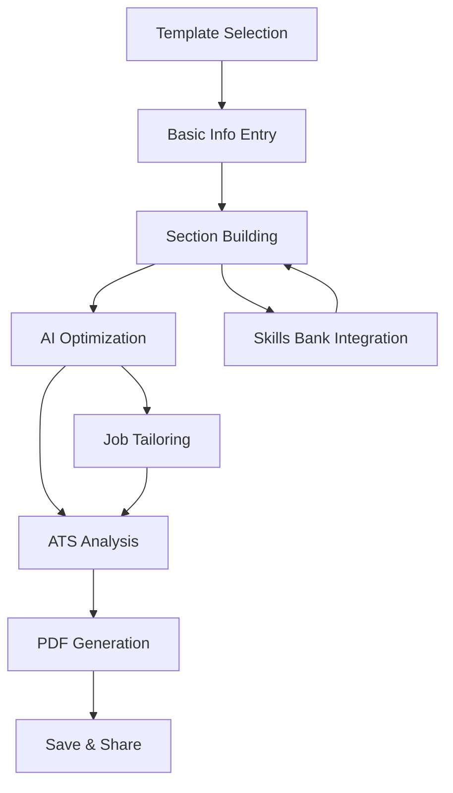

# 📝 Resume Builder UI Integration Plan

## 🎯 Overview

This document outlines the integration strategy for adding resume building capabilities to the JobPilot-OpenManus web interface, adapting resume-lm's React/Next.js components to our Solid.js architecture.

## 🏗️ UI Integration Architecture

### **Current JobPilot UI Stack**
- **Framework**: Solid.js + TailwindCSS + DaisyUI
- **Build Tool**: Vite
- **Backend**: FastAPI + WebSocket
- **State Management**: Solid.js stores and signals

### **resume-lm UI Stack**
- **Framework**: React 19 + Next.js 15
- **Components**: Shadcn UI + Radix UI
- **Styling**: TailwindCSS
- **Rich Text**: TipTap editor
- **PDF**: React-PDF renderer

## 🔄 Component Conversion Strategy

### **1. Component Architecture Mapping**

| resume-lm Component | JobPilot Solid.js Equivalent | Status |
|-------------------|------------------------------|---------|
| `ResumeEditor` | `ResumeBuilder` | 📋 Planned |
| `ResumePreview` | `ResumePreview` | 📋 Planned |
| `SectionEditor` | `ResumeSectionEditor` | 📋 Planned |
| `TemplateSelector` | `TemplateSelector` | 📋 Planned |
| `ATSScoreCard` | `ATSAnalyzer` | 📋 Planned |
| `SkillsManager` | `SkillBankManager` | 📋 Planned |
| `JobTailoringPanel` | `JobTailoringPanel` | 📋 Planned |

### **2. UI Component Structure**

```
frontend/src/components/resume/
├── core/
│   ├── ResumeBuilder.tsx          # Main resume building interface
│   ├── ResumePreview.tsx          # Live resume preview panel
│   ├── ResumeList.tsx             # User's resume management
│   └── ResumeVersionHistory.tsx   # Version control UI
├── sections/
│   ├── ContactInfoEditor.tsx      # Contact information form
│   ├── SummaryEditor.tsx          # Professional summary editor
│   ├── ExperienceEditor.tsx       # Work experience builder
│   ├── EducationEditor.tsx        # Education section manager
│   ├── SkillsEditor.tsx           # Skills section with AI assistance
│   ├── ProjectsEditor.tsx         # Projects showcase
│   └── CustomSectionEditor.tsx   # Generic custom sections
├── templates/
│   ├── TemplateSelector.tsx       # Template chooser
│   ├── TemplatePreview.tsx        # Template preview cards
│   └── TemplateCustomizer.tsx     # Style customization
├── analysis/
│   ├── ATSAnalyzer.tsx            # ATS compatibility checker
│   ├── JobMatchAnalyzer.tsx       # Job-resume matching
│   └── ResumeScoreCard.tsx        # Overall resume scoring
├── skills/
│   ├── SkillBankManager.tsx       # Centralized skill management
│   ├── SkillExtractor.tsx         # AI skill extraction from experience
│   ├── SkillSuggestions.tsx       # AI-powered skill suggestions
│   └── SkillCategorizer.tsx       # Skill organization interface
├── tailoring/
│   ├── JobTailoringPanel.tsx      # Job-specific optimization
│   ├── KeywordHighlighter.tsx     # Keyword matching visualization
│   ├── SectionRecommender.tsx     # Section emphasis suggestions
│   └── TailoringHistory.tsx       # Track tailoring changes
├── generation/
│   ├── AIResumeGenerator.tsx      # AI-powered resume generation
│   ├── ContentSuggestions.tsx     # AI content improvement tips
│   ├── BulletPointOptimizer.tsx   # Achievement statement optimization
│   └── ToneAdjuster.tsx           # Professional tone adjustment
└── shared/
    ├── RichTextEditor.tsx         # Rich text editing component
    ├── PDFGenerator.tsx           # PDF export functionality
    ├── ResumeImporter.tsx         # Import existing resumes
    └── ProgressTracker.tsx        # Build progress indicator
```

## 🎨 Design System Integration

### **Component Library Mapping**

| resume-lm (Shadcn/Radix) | JobPilot (DaisyUI) | Implementation |
|-------------------------|-------------------|----------------|
| `Button` | `btn` | ✅ Direct mapping |
| `Input` | `input` | ✅ Direct mapping |
| `Textarea` | `textarea` | ✅ Direct mapping |
| `Select` | `select` | ✅ Direct mapping |
| `Dialog` | `modal` | ✅ Direct mapping |
| `Tabs` | `tabs` | ✅ Direct mapping |
| `Accordion` | `collapse` | ✅ Direct mapping |
| `Card` | `card` | ✅ Direct mapping |
| `Progress` | `progress` | ✅ Direct mapping |
| `Badge` | `badge` | ✅ Direct mapping |

### **Custom Components Needed**

1. **Rich Text Editor**
   - Convert TipTap (React) to Solid.js equivalent
   - Use prosemirror directly or solid-js-prosemirror
   - Features: Bold, italic, bullet points, formatting

2. **Drag & Drop Sections**
   - Section reordering functionality
   - Use @thisbeyond/solid-dnd
   - Visual feedback for section placement

3. **Live Preview Panel**
   - Real-time resume rendering
   - Split-pane layout with editor/preview
   - Responsive preview for different formats

## 🔌 Backend Integration

### **API Endpoints Required**

```typescript
// Resume Management
GET    /api/resumes                     // List user resumes
POST   /api/resumes                     // Create new resume
GET    /api/resumes/:id                 // Get specific resume
PUT    /api/resumes/:id                 // Update resume
DELETE /api/resumes/:id                 // Delete resume

// Resume Building
POST   /api/resumes/:id/sections        // Add/update resume section
DELETE /api/resumes/:id/sections/:type  // Remove section
POST   /api/resumes/:id/generate        // AI-generate resume content
POST   /api/resumes/:id/optimize        // AI-optimize existing content

// Templates
GET    /api/resume-templates            // List available templates
GET    /api/resume-templates/:id        // Get specific template
POST   /api/resume-templates            // Create custom template

// Skills Management
GET    /api/skills/bank                 // Get user's skill bank
POST   /api/skills/extract              // Extract skills from text
POST   /api/skills/suggest              // Get AI skill suggestions
PUT    /api/skills/bank                 // Update skill bank

// Analysis & Scoring
POST   /api/resumes/:id/ats-score       // Calculate ATS compatibility
POST   /api/resumes/:id/job-match       // Analyze job match
POST   /api/resumes/:id/tailor          // Create job-tailored version

// PDF Generation
POST   /api/resumes/:id/pdf             // Generate PDF
GET    /api/resumes/:id/pdf/:version    // Download specific PDF version
```

### **WebSocket Events**

```typescript
// Real-time resume building
"resume:update"          // Resume content changed
"resume:section_added"   // New section added
"resume:ai_generating"   // AI generation in progress
"resume:ai_complete"     // AI generation complete
"resume:ats_score"       // ATS score updated
"resume:pdf_ready"       // PDF generation complete
```

## 🚀 User Experience Flow

### **1. Resume Builder Entry Points**

#### **From Job Listing**
```
Job Details → "Tailor Resume" → Resume Builder (with job context)
```

#### **From Dashboard**
```
Dashboard → "Resume Builder" → Template Selection → Resume Editor
```

#### **From Agent Chat**
```
Chat: "Create resume for this job" → AI generates base resume → Resume Builder
```

### **2. Resume Building Workflow**



### **3. Key User Actions**

1. **Create New Resume**
   - Choose template
   - Import existing resume (optional)
   - Fill basic contact info
   - Build sections incrementally

2. **Tailor Resume for Job**
   - Select base resume
   - Input job description
   - AI suggests optimizations
   - Review and apply changes
   - Generate job-specific version

3. **Manage Skill Bank**
   - Add skills manually
   - Extract from experience descriptions
   - Categorize and rate proficiency
   - Track skill usage across resumes

## 🎭 Component Implementation Examples

### **ResumeBuilder Component (Solid.js)**

```typescript
// frontend/src/components/resume/core/ResumeBuilder.tsx
import { createSignal, createMemo, Show, For } from "solid-js";
import { createStore } from "solid-js/store";

interface ResumeBuilderProps {
  resumeId?: string;
  jobId?: string;
  templateId?: string;
}

export default function ResumeBuilder(props: ResumeBuilderProps) {
  const [resume, setResume] = createStore<Resume>({
    // Initial resume structure
  });
  const [activeSection, setActiveSection] = createSignal<SectionType>("contact");
  const [isPreviewMode, setIsPreviewMode] = createSignal(false);

  // Real-time auto-save
  const autoSave = createMemo(() => {
    // Debounced save logic
  });

  return (
    <div class="flex h-screen bg-base-100">
      {/* Left Panel - Section Navigation */}
      <div class="w-64 bg-base-200 p-4">
        <SectionNavigator 
          sections={resume.sections}
          activeSection={activeSection()}
          onSectionChange={setActiveSection}
        />
      </div>

      {/* Center Panel - Editor */}
      <div class="flex-1 flex flex-col">
        <div class="bg-white border-b p-4">
          <ResumeToolbar 
            resume={resume}
            onPreviewToggle={() => setIsPreviewMode(!isPreviewMode())}
          />
        </div>
        
        <div class="flex-1 p-6 overflow-y-auto">
          <Show when={!isPreviewMode()} fallback={<ResumePreview resume={resume} />}>
            <SectionEditor 
              sectionType={activeSection()}
              data={resume[activeSection()]}
              onUpdate={(data) => setResume(activeSection(), data)}
            />
          </Show>
        </div>
      </div>

      {/* Right Panel - AI Assistant & Tools */}
      <div class="w-80 bg-base-200 p-4">
        <AIResumeAssistant 
          resume={resume}
          jobId={props.jobId}
          onSuggestion={(suggestion) => applySuggestion(suggestion)}
        />
      </div>
    </div>
  );
}
```

### **Integration with JobPilot Agent Chat**

```typescript
// Resume building commands in agent chat
const resumeCommands = {
  "create_resume": async (args: any) => {
    const resume = await resumeService.createResume(args);
    return `Created new resume: ${resume.title}`;
  },
  
  "tailor_resume": async (args: { resumeId: string, jobId: string }) => {
    const tailoredResume = await resumeService.tailorForJob(args.resumeId, args.jobId);
    return `Created tailored resume for job. ATS Score: ${tailoredResume.ats_score}`;
  },
  
  "optimize_resume": async (args: { resumeId: string }) => {
    const suggestions = await aiService.optimizeResume(args.resumeId);
    return `Found ${suggestions.length} optimization suggestions`;
  }
};
```

## 🔍 Advanced Features

### **1. AI Integration Points**

- **Content Generation**: Auto-generate summaries, achievements, descriptions
- **Skill Extraction**: Parse experience descriptions to extract skills
- **ATS Optimization**: Analyze and improve ATS compatibility
- **Job Matching**: Score resume against job requirements
- **Tone Adjustment**: Adjust language for different industries

### **2. Smart Features**

- **Auto-save**: Real-time saving with conflict resolution
- **Version Control**: Track changes and allow rollback
- **Collaboration**: Share resumes for feedback (future feature)
- **Analytics**: Track resume performance and views
- **Integration**: Sync with LinkedIn, import from PDF

### **3. Export Options**

- **PDF Generation**: Multiple template styles
- **Word Format**: .docx export for ATS systems
- **Plain Text**: Simple text version
- **JSON Export**: Structured data export
- **Print Optimized**: Printer-friendly layouts

## 📱 Mobile Considerations

### **Responsive Design**
- Mobile-first approach
- Touch-friendly interface
- Simplified mobile editor
- Preview mode optimization

### **Progressive Web App**
- Offline editing capability
- Mobile installation
- Push notifications for tips
- Local storage backup

## 🔧 Technical Implementation Notes

### **State Management**
- Use Solid.js stores for complex resume state
- Implement optimistic updates for better UX
- Handle concurrent editing conflicts

### **Performance**
- Lazy load heavy components (PDF generation)
- Virtual scrolling for large resume lists
- Debounced auto-save to prevent API spam
- Efficient diff calculation for version tracking

### **Accessibility**
- Keyboard navigation for all features
- Screen reader compatibility
- High contrast mode support
- Focus management for modals and editors
