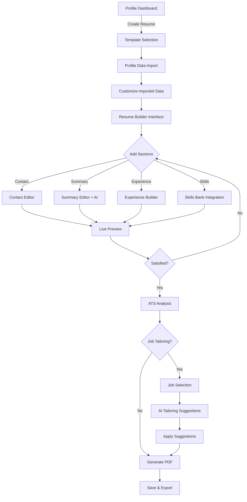

# 🗺️ Resume System Implementation Plan

## 🎯 Overview

This comprehensive plan outlines the implementation of a complete resume building and management system for JobPilot-OpenManus, integrating user profiles with AI-powered resume generation, job tailoring, and professional PDF output.

**Vision**: Create the most intelligent resume building system that seamlessly integrates with user profiles and leverages AI to optimize resumes for specific jobs while maintaining professional quality standards.

## 📊 Current State Analysis

### ✅ **What We Already Have**

#### **Backend Infrastructure - Complete**
- ✅ **UserProfileDB** - Complete database model with relationships
- ✅ **Resume Models** - Comprehensive data models for resumes (`app/data/resume_models.py`)
- ✅ **Resume Repository** - Database operations for resumes
- ✅ **Resume API** - Full CRUD endpoints (`/api/resumes`)
- ✅ **Resume Generation Utility** - `create_resume_from_profile` function
- ✅ **PDF Generation Service** - AI-powered resume generation with RenderCV
- ✅ **Skills Bank System** - Centralized skill management

#### **Frontend Infrastructure - Partial**
- ✅ **Resume Dashboard** - Basic resume management UI
- ✅ **ResumeList** - Resume listing component
- ✅ **ResumeBuilder** - Resume editing interface (basic)
- ✅ **ResumePreview** - Resume preview component
- ✅ **Resume Service** - API client for resume operations

#### **Data Model Alignment - Complete**
- ✅ **ContactInfo Model** - Shared between frontend/backend with consistent field names
- ✅ **Database Relationships** - UserProfile ↔ Resume ↔ SkillBank relationships established
- ✅ **Field Name Consistency** - All ContactInfo fields use `_url` suffix consistently

### ❌ **What's Missing or Needs Implementation**

#### **Frontend Integration Issues**
- [ ] **Navigation Between Profile/Resume** - No seamless flow between components
- [ ] **Resume Creation from Profile** - UI button/flow doesn't exist
- [ ] **Shared Data Consistency** - No real-time sync between profile and resume data
- [ ] **Profile → Resume Wizard** - No guided flow for first-time resume creation

#### **Advanced Features Missing**
- [ ] **AI-Powered Content Generation** - Smart resume content suggestions
- [ ] **Job Tailoring Interface** - Job-specific resume optimization
- [ ] **ATS Analysis Dashboard** - Real-time ATS compatibility scoring
- [ ] **Skills Bank UI** - Visual skills management interface
- [ ] **Template System UI** - Template selection and customization

## 🏗️ Technical Architecture

### **Backend Architecture**

```
app/
├── data/
│   ├── resume_models.py          # ✅ Complete - Resume data models
│   ├── models.py                 # ✅ Updated - UserProfile relationships
│   └── base.py                   # ✅ Complete - Database base
├── repositories/
│   └── resume_repository.py      # ✅ Complete - Resume CRUD operations
├── services/
│   ├── pdf_generation_service.py # ✅ Complete - PDF export with RenderCV
│   ├── resume_generation_service.py # ✅ Complete - AI content generation
│   └── llm_service.py            # ✅ Complete - LLM integrations
├── api/
│   └── resume_api.py             # ✅ Complete - REST endpoints
└── agents/
    └── resume_agent.py           # 📋 Planned - Specialized resume agent
```

### **Frontend Architecture**

```
frontend/src/components/resume/
├── core/
│   ├── ResumeBuilder.tsx          # 🔄 Basic → Advanced needed
│   ├── ResumePreview.tsx          # 🔄 Basic → Enhanced needed
│   ├── ResumeList.tsx             # ✅ Complete
│   └── ResumeVersionHistory.tsx   # 📋 Planned
├── sections/
│   ├── ContactInfoEditor.tsx      # 📋 Planned
│   ├── SummaryEditor.tsx          # 📋 Planned - AI-assisted
│   ├── ExperienceEditor.tsx       # 📋 Planned - Achievement optimizer
│   ├── EducationEditor.tsx        # 📋 Planned
│   ├── SkillsEditor.tsx           # 📋 Planned - Skills bank integration
│   ├── ProjectsEditor.tsx         # 📋 Planned
│   └── CustomSectionEditor.tsx   # 📋 Planned
├── templates/
│   ├── TemplateSelector.tsx       # 📋 Planned
│   ├── TemplatePreview.tsx        # 📋 Planned
│   └── TemplateCustomizer.tsx     # 📋 Planned
├── analysis/
│   ├── ATSAnalyzer.tsx            # 📋 Planned - Real-time ATS scoring
│   ├── JobMatchAnalyzer.tsx       # 📋 Planned - Job compatibility
│   └── ResumeScoreCard.tsx        # 📋 Planned - Overall scoring
├── skills/
│   ├── SkillBankManager.tsx       # 📋 Planned - Centralized management
│   ├── SkillExtractor.tsx         # 📋 Planned - AI extraction
│   ├── SkillSuggestions.tsx       # 📋 Planned - AI suggestions
│   └── SkillCategorizer.tsx       # 📋 Planned - Organization
├── tailoring/
│   ├── JobTailoringPanel.tsx      # 📋 Planned - Job-specific optimization
│   ├── KeywordHighlighter.tsx     # 📋 Planned - Keyword matching
│   ├── SectionRecommender.tsx     # 📋 Planned - Section emphasis
│   └── TailoringHistory.tsx       # 📋 Planned - Version tracking
├── generation/
│   ├── AIResumeGenerator.tsx      # 📋 Planned - AI-powered generation
│   ├── ContentSuggestions.tsx     # 📋 Planned - Content improvement
│   ├── BulletPointOptimizer.tsx   # 📋 Planned - Achievement optimization
│   └── ToneAdjuster.tsx           # 📋 Planned - Professional tone
└── shared/
    ├── RichTextEditor.tsx         # 📋 Planned - Rich text component
    ├── PDFGenerator.tsx           # 📋 Planned - Frontend PDF interface
    ├── ResumeImporter.tsx         # 📋 Planned - Import functionality
    └── ProgressTracker.tsx        # 📋 Planned - Build progress
```

### **Design System Integration**

| resume-lm (Shadcn/Radix) | JobPilot (DaisyUI) | Implementation |
|-------------------------|-------------------|----------------|
| `Button` | `btn` | ✅ Direct mapping |
| `Input` | `input` | ✅ Direct mapping |
| `Textarea` | `textarea` | ✅ Direct mapping |
| `Select` | `select` | ✅ Direct mapping |
| `Dialog` | `modal` | ✅ Direct mapping |
| `Tabs` | `tabs` | ✅ Direct mapping |
| `Accordion` | `collapse` | ✅ Direct mapping |
| `Card` | `card` | ✅ Direct mapping |
| `Progress` | `progress` | ✅ Direct mapping |
| `Badge` | `badge` | ✅ Direct mapping |

### **Custom Components Needed**

1. **Rich Text Editor**
   - Convert TipTap (React) to Solid.js equivalent
   - Use prosemirror directly or solid-js-prosemirror
   - Features: Bold, italic, bullet points, formatting

2. **Drag & Drop Sections**
   - Section reordering functionality
   - Use @thisbeyond/solid-dnd
   - Visual feedback for section placement

3. **Live Preview Panel**
   - Real-time resume rendering
   - Split-pane layout with editor/preview
   - Responsive preview for different formats

## 🔌 API Integration

### **Resume Management Endpoints**

```typescript
// Resume CRUD Operations
GET    /api/resumes                     // List user resumes
POST   /api/resumes                     // Create new resume
GET    /api/resumes/:id                 // Get specific resume
PUT    /api/resumes/:id                 // Update resume
DELETE /api/resumes/:id                 // Delete resume

// Resume Building Operations
POST   /api/resumes/:id/sections        // Add/update resume section
DELETE /api/resumes/:id/sections/:type  // Remove section
POST   /api/resumes/:id/generate        // AI-generate resume content
POST   /api/resumes/:id/optimize        // AI-optimize existing content

// Template Management
GET    /api/resume-templates            // List available templates
GET    /api/resume-templates/:id        // Get specific template
POST   /api/resume-templates            // Create custom template

// Skills Management
GET    /api/skills/bank                 // Get user's skill bank
POST   /api/skills/extract              // Extract skills from text
POST   /api/skills/suggest              // Get AI skill suggestions
PUT    /api/skills/bank                 // Update skill bank

// Analysis & Optimization
POST   /api/resumes/:id/ats-score       // Calculate ATS compatibility
POST   /api/resumes/:id/job-match       // Analyze job match
POST   /api/resumes/:id/tailor          // Create job-tailored version

// PDF Generation & Export
POST   /api/resumes/:id/pdf             // Generate PDF
GET    /api/resumes/:id/pdf/:version    // Download specific PDF version
POST   /api/resumes/:id/export          // Export in various formats
```

### **WebSocket Events for Real-Time Updates**

```typescript
// Real-time resume building events
"resume:update"          // Resume content changed
"resume:section_added"   // New section added
"resume:ai_generating"   // AI generation in progress
"resume:ai_complete"     // AI generation complete
"resume:ats_score"       // ATS score updated
"resume:pdf_ready"       // PDF generation complete
"resume:tailoring"       // Job tailoring in progress
"resume:suggestions"     // New AI suggestions available
```

## 🚀 Implementation Phases

### **Phase 1: Core Infrastructure Enhancement (2-3 weeks)**

#### **Week 1: Database & API Completion**
- [ ] **Database Migration Creation**
  - Create migration for new UserProfile ↔ Resume relationships
  - Add indexes for performance optimization
  - Test migration with existing data

- [ ] **API Response Standardization**
  - Ensure all resume endpoints return consistent JSON structure
  - Update error handling to match frontend expectations
  - Add comprehensive API documentation

- [ ] **End-to-End Testing**
  - Test complete data flow from frontend to backend
  - Validate field mapping consistency
  - Performance testing for large resume datasets

#### **Week 2-3: Core UI Components**
- [ ] **Enhanced Resume Builder**
  - Three-pane layout (navigation, editor, preview)
  - Section-based editing with drag-and-drop reordering
  - Auto-save functionality with conflict resolution
  - Real-time preview updates

- [ ] **Section Editors Foundation**
  - Contact information form with validation
  - Professional summary editor with character limits
  - Work experience builder with dynamic entry addition
  - Education section with institution validation

### **Phase 2: Integration & User Experience (2-3 weeks)**

#### **Week 4: Profile ↔ Resume Integration**
- [ ] **Navigation Enhancement**
  - Add "Create Resume" button in Profile Dashboard
  - Implement resume creation flow from profile data
  - Add "Edit Profile" link in Resume Dashboard
  - Create breadcrumb navigation between sections

- [ ] **Resume Creation Wizard**
  - Multi-step wizard component with progress tracking
  - Profile data import step with customization options
  - Template selection with live preview
  - Final review and creation confirmation

#### **Week 5-6: Skills Bank & AI Integration**
- [ ] **Skills Bank UI**
  - Visual skills management interface
  - Drag-and-drop skill organization
  - Skill proficiency indicators and categorization
  - AI skill extraction from job descriptions

- [ ] **Basic AI Features**
  - Content suggestions for resume sections
  - Basic ATS compatibility scoring
  - Simple job-resume matching indicators

### **Phase 3: Advanced Features (3-4 weeks)**

#### **Week 7-8: AI-Powered Enhancement**
- [ ] **AI Content Generation**
  - Auto-generate professional summaries
  - Optimize achievement statements and bullet points
  - Suggest improvements based on industry best practices
  - Tone adjustment for different job types

- [ ] **ATS Analysis Dashboard**
  - Real-time ATS score calculation and display
  - Keyword optimization suggestions
  - Section-specific improvement recommendations
  - Missing skills identification

#### **Week 9-10: Job Tailoring System**
- [ ] **Job-Specific Optimization**
  - Interface for selecting target job
  - Highlight relevant skills and experience
  - Suggest section emphasis and keyword additions
  - Generate job-specific resume versions

- [ ] **Tailoring History & Version Control**
  - Track different resume versions for different jobs
  - Compare tailored versions with diff visualization
  - Revert to previous versions
  - Export comparison reports

### **Phase 4: Polish & Advanced Features (2-3 weeks)**

#### **Week 11-12: Template System & Export**
- [ ] **Template Management**
  - Visual template gallery with previews
  - Template customization interface
  - Custom template creation tools
  - Template sharing capabilities

- [ ] **Enhanced Export Options**
  - Multiple PDF templates and styles
  - Word format (.docx) export for ATS systems
  - Plain text and structured data exports
  - Print-optimized layouts

#### **Week 13: Performance & Analytics**
- [ ] **Performance Optimization**
  - Lazy loading for heavy components
  - Efficient state management optimization
  - PDF generation performance improvements
  - Database query optimization

- [ ] **Analytics & Insights**
  - Resume performance tracking
  - Usage analytics and insights
  - Success metrics and recommendations
  - User behavior analysis for improvements

## 🌟 User Experience Flow

### **Resume Building Workflow**



### **Key User Actions**

1. **Create New Resume**
   - Choose from professional templates
   - Import data from existing profile
   - Customize imported information
   - Build sections incrementally

2. **Tailor Resume for Job**
   - Select base resume version
   - Input or select job description
   - Review AI optimization suggestions
   - Apply changes and generate tailored version

3. **Manage Skills Bank**
   - Add skills manually or extract from descriptions
   - Categorize and rate skill proficiency
   - Track skill usage across resume versions
   - Get suggestions for skill improvements

## 🎭 Component Implementation Examples

### **ResumeBuilder Component (Solid.js)**

```typescript
// frontend/src/components/resume/core/ResumeBuilder.tsx
import { createSignal, createMemo, Show, For } from "solid-js";
import { createStore } from "solid-js/store";

interface ResumeBuilderProps {
  resumeId?: string;
  jobId?: string;
  templateId?: string;
}

export default function ResumeBuilder(props: ResumeBuilderProps) {
  const [resume, setResume] = createStore<Resume>({
    // Initial resume structure
  });
  const [activeSection, setActiveSection] = createSignal<SectionType>("contact");
  const [isPreviewMode, setIsPreviewMode] = createSignal(false);
  const [isSaving, setIsSaving] = createSignal(false);

  // Real-time auto-save with debouncing
  const autoSave = createMemo(() => {
    if (resume.id) {
      debounce(() => saveResume(resume), 1000);
    }
  });

  return (
    <div class="flex h-screen bg-base-100">
      {/* Left Panel - Section Navigation */}
      <div class="w-64 bg-base-200 p-4">
        <SectionNavigator
          sections={resume.sections}
          activeSection={activeSection()}
          onSectionChange={setActiveSection}
        />
        <div class="mt-4">
          <ATSScoreCard resume={resume} />
        </div>
      </div>

      {/* Center Panel - Editor */}
      <div class="flex-1 flex flex-col">
        <div class="bg-white border-b p-4">
          <ResumeToolbar
            resume={resume}
            isSaving={isSaving()}
            onPreviewToggle={() => setIsPreviewMode(!isPreviewMode())}
            onExport={() => exportResume(resume.id)}
          />
        </div>

        <div class="flex-1 p-6 overflow-y-auto">
          <Show when={!isPreviewMode()} fallback={<ResumePreview resume={resume} />}>
            <SectionEditor
              sectionType={activeSection()}
              data={resume[activeSection()]}
              onUpdate={(data) => setResume(activeSection(), data)}
            />
          </Show>
        </div>
      </div>

      {/* Right Panel - AI Assistant & Tools */}
      <div class="w-80 bg-base-200 p-4">
        <AIResumeAssistant
          resume={resume}
          jobId={props.jobId}
          onSuggestion={(suggestion) => applySuggestion(suggestion)}
        />
        <div class="mt-4">
          <SkillBankPanel
            skills={resume.skills}
            onSkillsUpdate={(skills) => setResume("skills", skills)}
          />
        </div>
      </div>
    </div>
  );
}
```

### **Integration with JobPilot Agent Chat**

```typescript
// Resume building commands in agent chat
const resumeCommands = {
  "create_resume": async (args: any) => {
    const resume = await resumeService.createResume(args);
    return `Created new resume: ${resume.title}. Ready for editing in Resume Builder.`;
  },

  "tailor_resume": async (args: { resumeId: string, jobId: string }) => {
    const tailoredResume = await resumeService.tailorForJob(args.resumeId, args.jobId);
    return `Created tailored resume for job. ATS Score improved to ${tailoredResume.ats_score}%.`;
  },

  "optimize_resume": async (args: { resumeId: string }) => {
    const suggestions = await aiService.optimizeResume(args.resumeId);
    return `Generated ${suggestions.length} optimization suggestions for your resume.`;
  },

  "generate_pdf": async (args: { resumeId: string, template?: string }) => {
    const pdfResult = await pdfService.generatePDF(args.resumeId, args.template);
    return `PDF resume generated successfully. Download: ${pdfResult.downloadUrl}`;
  }
};
```

## ⚡ Advanced AI Features

### **1. Intelligent Content Generation**
- **Smart Summaries**: AI-generated professional summaries tailored to job types
- **Achievement Optimization**: Transform job duties into impactful achievement statements
- **Keyword Integration**: Automatic keyword incorporation based on job descriptions
- **Tone Adjustment**: Adjust language for different industries (tech, finance, creative)

### **2. ATS Optimization Engine**
- **Real-time Scoring**: Live ATS compatibility scoring as user types
- **Keyword Analysis**: Identify missing keywords from job descriptions
- **Format Optimization**: Suggest formatting improvements for ATS parsing
- **Section Analysis**: Recommend section emphasis based on job requirements

### **3. Job Matching Intelligence**
- **Compatibility Scoring**: Multi-dimensional job-resume compatibility analysis
- **Skill Gap Analysis**: Identify missing skills and suggest improvements
- **Experience Mapping**: Map user experience to job requirements
- **Success Prediction**: Predict application success likelihood

### **4. Smart Suggestions**
- **Content Improvement**: Real-time suggestions for better phrasing
- **Section Enhancement**: Recommend additional sections based on profile
- **Skills Integration**: Suggest skills from experience descriptions
- **Template Recommendations**: AI-powered template selection based on industry

## 📱 Mobile & Accessibility Considerations

### **Responsive Design**
- Mobile-first approach with touch-friendly interfaces
- Simplified mobile editor with essential features
- Optimized preview mode for mobile viewing
- Progressive Web App (PWA) capabilities

### **Accessibility Features**
- Full keyboard navigation support
- Screen reader compatibility with ARIA labels
- High contrast mode support
- Focus management for modals and complex interfaces
- Voice input support for content creation

## 🔧 Technical Implementation Notes

### **State Management**
- Use Solid.js stores for complex resume state
- Implement optimistic updates for better UX
- Handle concurrent editing conflicts with operational transforms
- Efficient diff calculation for version tracking

### **Performance Optimization**
- Lazy load heavy components (PDF generation, rich text editor)
- Virtual scrolling for large resume lists
- Debounced auto-save to prevent API spam
- Efficient re-rendering with Solid.js reactivity

### **Error Handling**
- Comprehensive error boundaries for component failures
- Graceful degradation for AI service outages
- Offline capability with local storage fallback
- User-friendly error messages with recovery suggestions

## 📊 Success Metrics

### **User Experience Metrics**
- [ ] Resume creation completion rate > 85%
- [ ] Average time to create first resume < 15 minutes
- [ ] User retention after first resume creation > 70%
- [ ] ATS score improvement average > 15 points

### **Technical Performance Metrics**
- [ ] Resume builder page load time < 2 seconds
- [ ] PDF generation time < 10 seconds
- [ ] Auto-save response time < 500ms
- [ ] 99.9% uptime for resume operations

### **Feature Adoption Metrics**
- [ ] Profile-to-resume conversion rate > 60%
- [ ] Job tailoring feature usage > 40%
- [ ] AI suggestion acceptance rate > 50%
- [ ] Multi-version resume creation > 30%

---

**Status**: Ready for Implementation - Phase 1 Foundation  
**Next Milestone**: Complete API standardization and database migration  
**Estimated Completion**: 10-13 weeks for full implementation  
**Last Updated**: 2025-01-18
