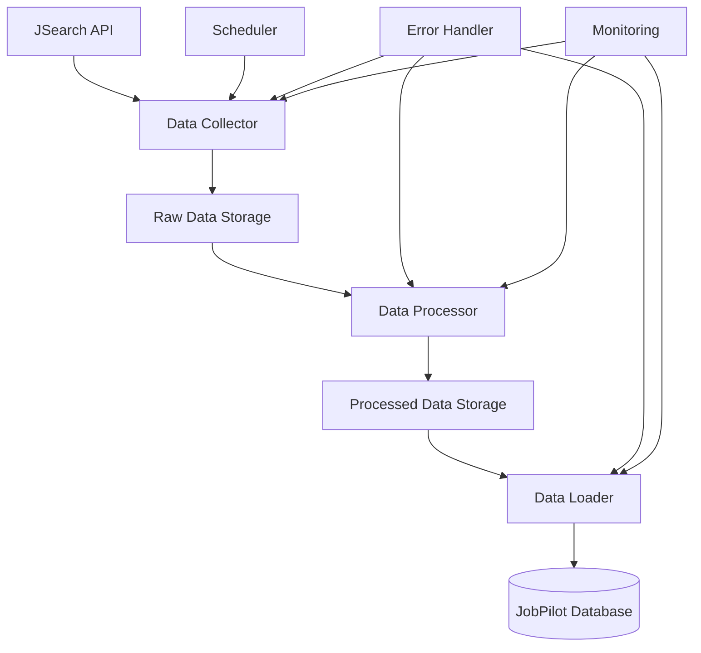

# JSearch API Integration Architecture
*Robust ETL Pipeline Design for JobPilot Phase 2*

---

## 🎯 **Architecture Philosophy**

### **Core Principles**
1. **Separation of Concerns**: Extract, Transform, Load are independent processes
2. **Fault Tolerance**: Each stage can fail and recover without affecting others
3. **Data Persistence**: Raw data is preserved at every stage
4. **API Efficiency**: Minimize external API calls through smart caching and retry logic
5. **Scalability**: Components can be scaled independently
6. **Observability**: Full logging and monitoring at each stage

### **Benefits**
- **Reduced API Costs**: Never lose data due to processing failures
- **Independent Recovery**: Fix processing errors without re-fetching data
- **Horizontal Scaling**: Each component can scale based on needs
- **Data Integrity**: Multiple checkpoints and validation stages
- **Development Speed**: Test processing logic without API calls

---

## 🏗️ **ETL Pipeline Architecture**



---

## 📥 **Stage 1: EXTRACT (Data Collection)**

### **Component: JSearchDataCollector**

#### **Responsibilities**
- Fetch raw job data from JSearch API
- Store raw responses without modification
- Handle rate limiting and API errors
- Track collection metadata (timestamps, query params, etc.)

#### **Data Storage Structure**
```json
{
  "collection_id": "uuid",
  "timestamp": "2025-08-14T15:30:00Z",
  "api_provider": "jsearch",
  "query_params": {
    "query": "python developer",
    "location": "San Francisco, CA",
    "page": 1
  },
  "raw_response": {
    "status": "OK",
    "data": [/* raw job objects */]
  },
  "metadata": {
    "response_time_ms": 650,
    "job_count": 10,
    "api_calls_used": 1,
    "collection_strategy": "scheduled"
  },
  "processing_status": "pending",
  "error_info": null
}
```

#### **Storage Location**
- **Primary**: `raw_job_data` database table
- **Backup**: JSON files in `data/raw_collections/YYYY/MM/DD/`
- **Indexing**: By timestamp, query_hash, processing_status

#### **Collection Strategies**
1. **Scheduled Collection**: Regular intervals (daily/hourly)
2. **On-Demand Collection**: User-triggered searches
3. **Batch Collection**: Multiple queries in sequence
4. **Incremental Collection**: Only fetch new/updated jobs

#### **Error Handling**
- **API Rate Limits**: Exponential backoff with jitter
- **Network Failures**: Retry with circuit breaker pattern
- **Invalid Responses**: Log and continue (don't fail entire batch)
- **Storage Failures**: Fall back to file system, alert admins

---

## 🔄 **Stage 2: TRANSFORM (Data Processing)**

### **Component: JobDataProcessor**

#### **Responsibilities**
- Transform raw API data to JobPilot schema
- Extract and normalize job requirements
- Generate semantic embeddings
- Detect and flag duplicates
- Validate data quality

#### **Processing Pipeline**
```python
class JobDataProcessor:
    async def process_collection(self, collection_id: str):
        # 1. Load raw data
        raw_data = await self.load_raw_collection(collection_id)

        # 2. Transform each job
        processed_jobs = []
        for raw_job in raw_data['raw_response']['data']:
            try:
                processed_job = await self.transform_job(raw_job)
                processed_jobs.append(processed_job)
            except Exception as e:
                await self.log_processing_error(raw_job, e)

        # 3. Generate embeddings
        await self.generate_embeddings(processed_jobs)

        # 4. Detect duplicates
        await self.detect_duplicates(processed_jobs)

        # 5. Store processed data
        await self.store_processed_data(collection_id, processed_jobs)
```

#### **Transformation Logic**
1. **Schema Mapping**: Raw API fields → JobPilot fields
2. **Data Cleaning**: Normalize text, validate URLs, parse dates
3. **Requirements Extraction**: Parse job descriptions for skills/experience
4. **Location Standardization**: Geocode and standardize location formats
5. **Company Enrichment**: Look up company information
6. **Salary Parsing**: Extract salary ranges from various formats

#### **Processing Status Tracking**
```json
{
  "processing_id": "uuid",
  "collection_id": "uuid",
  "started_at": "2025-08-14T15:35:00Z",
  "completed_at": "2025-08-14T15:36:30Z",
  "status": "completed", // pending, processing, completed, failed, partial
  "jobs_processed": 8,
  "jobs_failed": 2,
  "errors": [
    {
      "job_index": 3,
      "error_type": "schema_validation",
      "error_message": "Missing required field: job_title",
      "raw_data": {...}
    }
  ],
  "metrics": {
    "processing_time_ms": 90000,
    "embeddings_generated": 8,
    "duplicates_detected": 1
  }
}
```

#### **Error Handling**
- **Individual Job Failures**: Skip failed jobs, continue processing others
- **Schema Validation Errors**: Log and attempt data recovery
- **Embedding Generation Failures**: Retry with exponential backoff
- **Partial Processing**: Save successful jobs even if some fail

---

## 📤 **Stage 3: LOAD (Data Loading)**

### **Component: JobDataLoader**

#### **Responsibilities**
- Load processed jobs into main database
- Apply deduplication rules
- Update vector search indexes
- Trigger downstream processes (notifications, recommendations)

#### **Loading Pipeline**
```python
class JobDataLoader:
    async def load_processed_data(self, processing_id: str):
        # 1. Load processed data
        processed_data = await self.load_processed_data(processing_id)

        # 2. Deduplication check
        unique_jobs = await self.deduplicate_jobs(processed_data['jobs'])

        # 3. Database transaction
        async with self.db.transaction():
            job_ids = await self.insert_jobs(unique_jobs)
            await self.update_vector_index(job_ids)
            await self.update_search_cache()

        # 4. Trigger post-load processes
        await self.trigger_recommendations_update()
        await self.notify_job_updates(job_ids)
```

#### **Deduplication Strategy**
1. **Exact Match**: Same title + company + location
2. **Fuzzy Match**: Similar job descriptions (cosine similarity > 0.95)
3. **URL Match**: Same application URL from different sources
4. **Temporal Deduplication**: Same job posted within 7 days

#### **Database Schema Integration**
- **Jobs Table**: Main job records
- **Job Sources Table**: Track which API/source each job came from
- **Vector Embeddings**: Semantic search vectors
- **Processing Log**: Audit trail of all ETL operations

---

## 🗄️ **Data Storage Architecture**

### **Database Tables**

#### **raw_job_collections**
```sql
CREATE TABLE raw_job_collections (
    collection_id UUID PRIMARY KEY,
    timestamp TIMESTAMP NOT NULL,
    api_provider VARCHAR(50) NOT NULL,
    query_params JSONB NOT NULL,
    raw_response JSONB NOT NULL,
    metadata JSONB,
    processing_status VARCHAR(20) DEFAULT 'pending',
    created_at TIMESTAMP DEFAULT NOW()
);

CREATE INDEX idx_raw_collections_status ON raw_job_collections(processing_status);
CREATE INDEX idx_raw_collections_timestamp ON raw_job_collections(timestamp);
```

#### **job_processing_log**
```sql
CREATE TABLE job_processing_log (
    processing_id UUID PRIMARY KEY,
    collection_id UUID REFERENCES raw_job_collections(collection_id),
    started_at TIMESTAMP NOT NULL,
    completed_at TIMESTAMP,
    status VARCHAR(20) NOT NULL,
    jobs_processed INT DEFAULT 0,
    jobs_failed INT DEFAULT 0,
    errors JSONB,
    metrics JSONB,
    created_at TIMESTAMP DEFAULT NOW()
);
```

#### **processed_job_data**
```sql
CREATE TABLE processed_job_data (
    processing_id UUID REFERENCES job_processing_log(processing_id),
    job_index INT NOT NULL,
    processed_data JSONB NOT NULL,
    embedding VECTOR(1536), -- For OpenAI embeddings
    duplicate_of UUID,
    load_status VARCHAR(20) DEFAULT 'pending',
    created_at TIMESTAMP DEFAULT NOW(),

    PRIMARY KEY (processing_id, job_index)
);
```

### **File System Structure**
```
data/
├── raw_collections/           # Backup of raw API responses
│   ├── 2025/08/14/
│   │   ├── jsearch_001.json
│   │   └── jsearch_002.json
├── processed_data/            # Processed job data backup
│   ├── 2025/08/14/
│   │   ├── processed_001.json
├── failed_processing/         # Failed processing attempts
│   ├── 2025/08/14/
│   │   ├── failed_001.json
└── logs/                      # ETL operation logs
    ├── collector.log
    ├── processor.log
    └── loader.log
```

---

## ⚡ **Scheduling and Orchestration**

### **Component: ETLScheduler**

#### **Scheduling Strategies**
1. **Time-based**: Cron-like schedules
2. **Event-based**: Triggered by user actions
3. **Queue-based**: Process jobs from message queue
4. **Conditional**: Based on data freshness or API rate limits

#### **Example Schedule Configuration**
```yaml
schedules:
  daily_collection:
    trigger: "cron(0 9 * * *)"  # 9 AM daily
    queries:
      - "software engineer"
      - "data scientist"
      - "product manager"
    locations:
      - "San Francisco, CA"
      - "New York, NY"
      - "Seattle, WA"

  processing_batch:
    trigger: "after_collection"
    delay_minutes: 5

  loading_batch:
    trigger: "after_processing"
    delay_minutes: 2
```

### **Queue-Based Processing**
```python
# Message Queue Topics
TOPICS = {
    'job_collection_requests': 'Requests for data collection',
    'raw_data_processing': 'Raw data ready for processing',
    'processed_data_loading': 'Processed data ready for loading',
    'failed_operations': 'Failed operations for retry'
}

# Example message
collection_request = {
    'query': 'python developer',
    'location': 'Austin, TX',
    'priority': 'normal',
    'retry_count': 0,
    'max_retries': 3
}
```

---

## 🔧 **Error Handling and Recovery**

### **Recovery Strategies**

#### **Collection Failures**
- **Rate Limit Exceeded**: Wait and retry with exponential backoff
- **API Unavailable**: Switch to backup data source or pause collection
- **Network Issues**: Retry with circuit breaker pattern
- **Storage Failures**: Fall back to file system, alert administrators

#### **Processing Failures**
- **Individual Job Errors**: Skip and continue (don't fail entire batch)
- **Schema Changes**: Version processing logic and handle gracefully
- **Embedding API Failures**: Retry with different model or skip embeddings
- **Partial Processing**: Save successful results, retry failed items

#### **Loading Failures**
- **Database Constraints**: Handle duplicates gracefully
- **Transaction Failures**: Rollback and retry with smaller batches
- **Index Update Failures**: Queue for later retry, don't block main flow

### **Retry Logic**
```python
class RetryableOperation:
    async def execute_with_retry(self, operation, max_retries=3):
        for attempt in range(max_retries + 1):
            try:
                return await operation()
            except RetryableError as e:
                if attempt == max_retries:
                    await self.log_final_failure(operation, e)
                    raise

                delay = min(300, (2 ** attempt) + random.uniform(0, 1))
                await asyncio.sleep(delay)
```

---

## 📊 **Monitoring and Observability**

### **Key Metrics**
- **Collection Metrics**: API calls/hour, success rate, response times
- **Processing Metrics**: Jobs processed/hour, error rates, processing times
- **Loading Metrics**: Jobs loaded/hour, duplicate rates, index update times
- **Data Quality Metrics**: Field completeness, validation error rates

### **Alerting Rules**
- **API Rate Limit Approaching**: 80% of monthly quota used
- **High Error Rate**: >5% of jobs failing processing
- **Processing Delays**: Jobs waiting >1 hour for processing
- **Data Quality Issues**: >10% of jobs failing validation

### **Health Checks**
```python
class ETLHealthCheck:
    async def check_system_health(self):
        return {
            'collector': await self.check_collector_health(),
            'processor': await self.check_processor_health(),
            'loader': await self.check_loader_health(),
            'database': await self.check_database_health(),
            'api_quota': await self.check_api_quota()
        }
```

---

## 🔄 **Integration with Existing JobPilot Systems**

### **Phase 2 API Integration**
- **Enhanced Jobs API**: Load processed jobs into existing enhanced jobs tables
- **Job Sources API**: Create job source records for JSearch
- **Vector Search**: Use processed embeddings for semantic search
- **Deduplication API**: Integrate with existing deduplication logic

### **Database Schema Updates**
```sql
-- Add source tracking to existing jobs
ALTER TABLE enhanced_jobs ADD COLUMN source_collection_id UUID;
ALTER TABLE enhanced_jobs ADD COLUMN source_processing_id UUID;
ALTER TABLE enhanced_jobs ADD COLUMN raw_data JSONB;

-- Link to ETL pipeline
ALTER TABLE enhanced_jobs
ADD CONSTRAINT fk_source_collection
FOREIGN KEY (source_collection_id)
REFERENCES raw_job_collections(collection_id);
```

### **API Endpoint Updates**
- **GET /api/jobs**: Include ETL metadata in responses
- **POST /api/jobs/collect**: Trigger on-demand collection
- **GET /api/jobs/processing-status**: Check ETL pipeline status
- **POST /api/jobs/reprocess**: Retry failed processing jobs

---

## 🚀 **Implementation Phases**

### **Phase 1: Core ETL Pipeline (Week 1-2)**
1. **Data Collector**: JSearch API integration
2. **Raw Data Storage**: Database tables and file backup
3. **Basic Processing**: Schema transformation
4. **Simple Loading**: Insert into existing jobs table

### **Phase 2: Advanced Processing (Week 3)**
1. **Embedding Generation**: Integrate with vector search
2. **Duplicate Detection**: Advanced deduplication logic
3. **Data Validation**: Quality checks and error handling
4. **Processing Recovery**: Failed job retry mechanisms

### **Phase 3: Production Ready (Week 4)**
1. **Scheduling System**: Automated job collection
2. **Monitoring Dashboard**: ETL pipeline visibility
3. **Error Recovery**: Comprehensive failure handling
4. **Performance Optimization**: Batch processing, caching

### **Phase 4: Scale and Extend (Future)**
1. **Multi-API Support**: Add other job sources
2. **Real-time Processing**: Event-driven ETL
3. **Advanced Analytics**: Job market insights
4. **User-Triggered Collection**: Custom search collection

---

## 📋 **Implementation Checklist**

### **Infrastructure**
- [ ] Database tables for ETL pipeline
- [ ] File system storage structure
- [ ] Message queue setup (optional)
- [ ] Logging and monitoring setup

### **Core Components**
- [ ] JSearchDataCollector class
- [ ] JobDataProcessor class
- [ ] JobDataLoader class
- [ ] ETLScheduler class

### **Integration**
- [ ] Update existing Phase 2 APIs
- [ ] Database schema migrations
- [ ] Error handling integration
- [ ] Monitoring dashboard

### **Testing**
- [ ] Unit tests for each component
- [ ] Integration tests for full pipeline
- [ ] Error scenario testing
- [ ] Performance testing with large datasets

---

## 💡 **Key Architectural Decisions**

### **Why This Architecture?**
1. **Fault Isolation**: Each stage can fail independently
2. **Data Preservation**: Raw data never lost due to processing errors
3. **API Efficiency**: Minimize external API calls through persistence
4. **Scalability**: Components scale based on different bottlenecks
5. **Debugging**: Clear audit trail for troubleshooting
6. **Flexibility**: Easy to add new data sources or processing steps

### **Trade-offs**
- **Storage Overhead**: Storing raw + processed + final data
- **Complexity**: More components to manage and monitor
- **Processing Delay**: Multiple stages add latency
- **Initial Development**: More upfront complexity vs simple direct integration

### **Why These Trade-offs Are Worth It**
- **Reliability**: Critical for production system
- **Cost Savings**: Avoid unnecessary API calls
- **Development Speed**: Test processing without API calls
- **User Experience**: Never lose job data due to system errors

---

This architecture ensures **robust, scalable, and cost-effective** integration of JSearch API while maintaining **data integrity** and **system reliability**. The separation of concerns allows each component to be developed, tested, and scaled independently.

Ready to start implementing this architecture! 🚀
